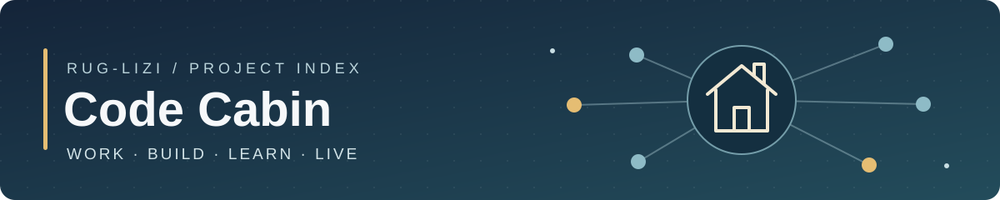

# 🗂️ rug-lizi · 项目地图

工作、应用、学习与生活项目的统一入口。

**24 个仓库** · 3 个公开 · 21 个私有 · 更新于 2026-10-08

[个人主页](https://github.com/rug-lizi) · [全部仓库](https://github.com/rug-lizi?tab=repositories)

> 标注「私有」的仓库需要登录有权限的 GitHub 账号。

## 🧭 快速导航

<table width="100%">
<tr>
<td width="50%"><a href="#teaching">🎓 教学建设</a> · 5</td>
<td width="50%"><a href="#ai-tools">🧠 AI 工具</a> · 5</td>
</tr>
<tr>
<td width="50%"><a href="#apps">🛠️ 开发实验</a> · 2</td>
<td width="50%"><a href="#research">🔭 数据与服务</a> · 2</td>
</tr>
<tr>
<td width="50%"><a href="#life">🌿 生活记录</a> · 5</td>
<td width="50%"><a href="#learning">📚 学习练习</a> · 4</td>
</tr>
</table>

## 📂 项目目录

<table width="100%">
<thead>
<tr><th width="28%" align="left">项目</th><th width="58%" align="left">用途</th><th width="14%" align="center">访&#8288;问</th></tr>
</thead>
<tbody>
<tr><th colspan="3" align="left">🎓 教学与专业建设 · 5 个项目</th></tr>
<tr><td><a href="https://github.com/rug-lizi/2026-IMET-Talent-Cultivation-Program">2026 人才培养方案</a></td><td>智能医疗装备技术专业人才培养方案、参考材料与配套数据。</td><td align="center">私&#8288;有</td></tr>
<tr><td><a href="https://github.com/rug-lizi/2026-IMET-Curriculum-Standards">2026 课程标准</a></td><td>智能医疗装备技术专业课程标准、教材选用与自动化设计。</td><td align="center">私&#8288;有</td></tr>
<tr><td><a href="https://github.com/rug-lizi/medical-equipment-management-cohort-case-study">订单班合作案例</a></td><td>校企合作、人才培养与专业转型的案例材料。</td><td align="center">私&#8288;有</td></tr>
<tr><td><a href="https://github.com/rug-lizi/lypt-beamer-ppt-latex">LYPT 演示模板</a></td><td>洛阳职业技术学院风格的个人改编 LaTeX 汇报模板。</td><td align="center">私&#8288;有</td></tr>
<tr><td><a href="https://github.com/rug-lizi/corporation-collaboration-miner">企业合作平台</a></td><td>企业随访与合作线索挖掘的预留仓库，目前为空。</td><td align="center">私&#8288;有</td></tr>
<tr><th colspan="3" align="left">🧠 AI 与效率工具 · 5 个项目</th></tr>
<tr><td><a href="https://github.com/rug-lizi/VoiNoter">VoiNoter 会议记录</a></td><td>Android 录音、语音转写、说话人区分与会议纪要。</td><td align="center">私&#8288;有</td></tr>
<tr><td><a href="https://github.com/rug-lizi/AI-Hardware-Model6">Model 6 硬件展柜</a></td><td>保留 6 个硬件想法，持续比较、替换与归档。</td><td align="center">私&#8288;有</td></tr>
<tr><td><a href="https://github.com/rug-lizi/skill-commons">百工馆 · Skills</a></td><td>Skills 的制作、分类、维护与复用。</td><td align="center">私&#8288;有</td></tr>
<tr><td><a href="https://github.com/rug-lizi/wps-cloud-organizer">WPS 云盘整理</a></td><td>WPS 云盘整理插件。</td><td align="center">公&#8288;开</td></tr>
<tr><td><a href="https://github.com/rug-lizi/AI-code-shack">AI 代码小屋</a></td><td>使用 Codex、Google AI Studio 等工具制作应用的实验小屋。</td><td align="center">私&#8288;有</td></tr>
<tr><th colspan="3" align="left">🛠️ 应用与开发实验 · 2 个项目</th></tr>
<tr><td><a href="https://github.com/rug-lizi/digital-products-store">数字产品商店</a></td><td>Stripe 支付、订单管理与自动下载交付。</td><td align="center">私&#8288;有</td></tr>
<tr><td><a href="https://github.com/rug-lizi/node-docker-app">Node / Docker 入门</a></td><td>Node.js 与 Docker 应用开发、部署练习。</td><td align="center">私&#8288;有</td></tr>
<tr><th colspan="3" align="left">🔭 服务器工具与数据研究 · 2 个项目</th></tr>
<tr><td><a href="https://github.com/rug-lizi/vpn-manager">个人 VPN 管理器</a></td><td>设备连接、配置与流量统计。</td><td align="center">私&#8288;有</td></tr>
<tr><td><a href="https://github.com/rug-lizi/polymarket-observatory">预测市场观察站</a></td><td>公开市场数据采集、价格偏离观察、实时看板与中文日报。</td><td align="center">私&#8288;有</td></tr>
<tr><th colspan="3" align="left">🌿 生活与个人记录 · 5 个项目</th></tr>
<tr><td><a href="https://github.com/rug-lizi/Personal-Moments-Gallery">个人时刻相册</a></td><td>个人时刻与相册项目。</td><td align="center">私&#8288;有</td></tr>
<tr><td><a href="https://github.com/rug-lizi/sparks---creative-video-journal">Sparks 视频日记</a></td><td>创意视频与日记项目。</td><td align="center">私&#8288;有</td></tr>
<tr><td><a href="https://github.com/rug-lizi/health-medicine-diet">健康与生活方式</a></td><td>个人健康、饮食、运动与生活方式记录。</td><td align="center">私&#8288;有</td></tr>
<tr><td><a href="https://github.com/rug-lizi/Swim-and-some-workout">游泳与锻炼</a></td><td>围绕游泳与锻炼的个人记录和自我管理。</td><td align="center">私&#8288;有</td></tr>
<tr><td><a href="https://github.com/rug-lizi/shits">Shits 随笔与文字</a></td><td>随笔、文字与自由记录。</td><td align="center">公&#8288;开</td></tr>
<tr><th colspan="3" align="left">📚 学习与编程练习 · 4 个项目</th></tr>
<tr><td><a href="https://github.com/rug-lizi/d2l">动手学深度学习</a></td><td>Dive into Deep Learning 的学习与代码练习。</td><td align="center">私&#8288;有</td></tr>
<tr><td><a href="https://github.com/rug-lizi/d2l_env">深度学习环境</a></td><td>动手学深度学习的环境配置仓库。</td><td align="center">私&#8288;有</td></tr>
<tr><td><a href="https://github.com/rug-lizi/fCC_Python_tutorial">Python 教程练习</a></td><td>Python 教程练习。</td><td align="center">私&#8288;有</td></tr>
<tr><td><a href="https://github.com/rug-lizi/PyGames">PyGames 游戏练习</a></td><td>Python 游戏与其他游戏练习。</td><td align="center">私&#8288;有</td></tr>
</tbody>
</table>

---

🏡 **[Homepage](https://github.com/rug-lizi/Homepage)** · 公开 
这里是入口，各项目的详细文档与当前进展保留在对应仓库。
